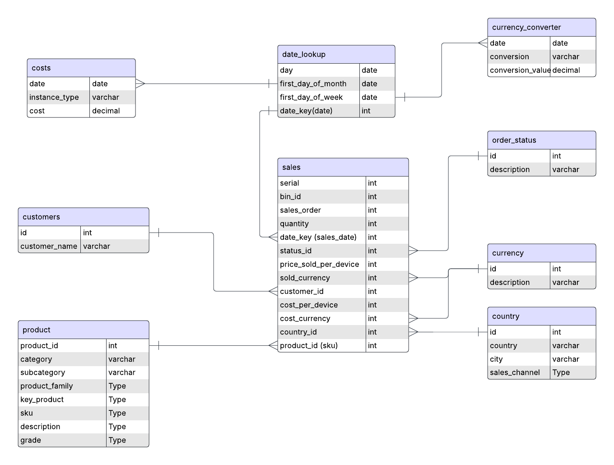

## Data Model

## Notes on the task
- 9 tables are created from the provided dataset. Please refer to `ddl.sql`
- 5 Raw data sheets are read and loaded to the S3 bucket as is.
- To mimic loading data from S3 to a Data Warehouse, Pandas was used to do the ETL to deliver data to its target tables.
- 9 dataframes are created in the notebook to match the target tables.
  - SalesData.csv
    - sales
    - product
    - currency
    - order_status
  - costs.csv
    - costs
  - FX_Table.csv
    - currency_converter
  - Customer_Table.csv
    - customers
  - Country_Table.csv
    - country
  - date_lookup (created in pandas)
- pandas was used for data manipulation to speed up setup time.
- hash function in python was used for data surrogation which is not the best option. The best practice is to store natural keys and surrogate keys in a separate schema in the DWH.
- it was detected that the date in the `costs` table are the `first day of the month`, and the dates in the `fx_table` are `first day of the week` (Monday). So, these were added as calculated_columns to the `date_lookup` table to connect to those 2 tables. 

## How to run your scripts
- clone the repo
- Create a conda environment on your local machine

`conda create --name alchemy python=3.13.2`

`conda activate alchemy`

`pip install pandas notebook boto3`

- Create IAM User on AWS and give it access to read and write to S3, You will need the `AWS access key` and `AWS secret key` for this IAM user while running the notebook.
- Create a bucket in your S3 account.
- Go to the project path, open the notebook `explore.ipynb`, edit the 2nd cell with the relevant information.
- The load part is still incomplete, as it heavily depends on the target database provider and what engine is needed to communicate with it. I left a code example which I thought was enough to deliver the idea while saving time. In addition, we need to discuss the load mode first; will we insert, upsert, or historize?

## How the scripts would be scheduled and run on AWS
- It's preferable to use an orchestrator like Airflow or Nifii to schedule running our jobs and take care of tasks dependencies.
- Most importantly is to save the raw data in S3 (staging layer). So we will need a pipeline(DAG) for that.
- We will need another DAG to do the following. 
  - read raw data from S3
  - create surrogate keys from the specified columns (data modeling decision)
  - data transformation
  - and loading
- the 2 DAGs could be encapsulated into one DAG. 